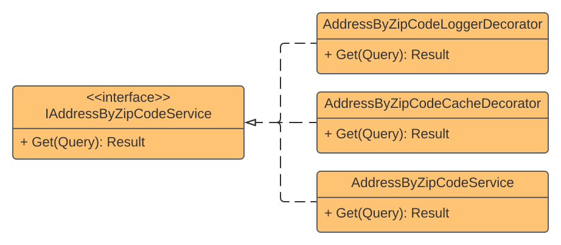

## Decorator

### Definition
A **Decorator** is a **structural** design pattern used for dynamically adding behavior to a component without touching existing code. 

### Real-World Uses Cases
- **Crosscutting** concerns like **logging**, **caching**, **authorization**, and more
- **Data manipulation** going to/from component

### Challenge
Develop an integration with **ViaCEP** service to get address information by zip code. The solution must **log** **request** and **response** data and avoid unnecessary extra calls during one day. 

### Solution
1. Extract an _interface_ from the service
2. Implement **logger** and **caching** decorators from the same _interface_
3. Define the execution order using **dependency injection**
5. Like **middlewares**, each decorator calls the next and then returns
6. You can add new decorators without touching existing ones

### Components Relationship

### Extras
- I've used [Scrutor](https://github.com/khellang/Scrutor) for decorators Dependency Injection
